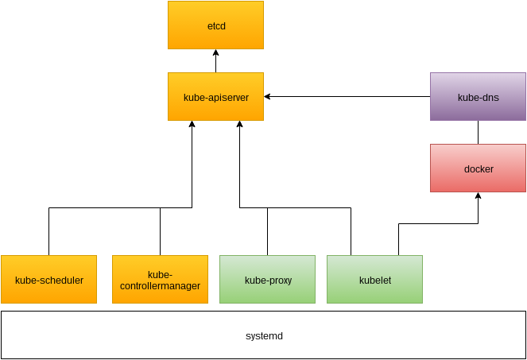
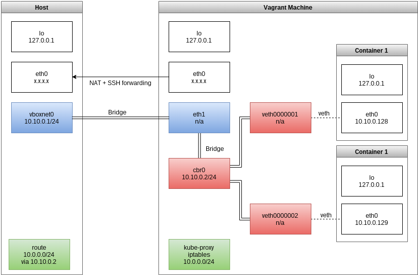

# How to setup a lightweight Kubernetes Vagrant Machine

## Quickstart

```
vagrant init flixtech/kubernetes; vagrant up --provider virtualbox
```

## TL;DR

```
make
make add-box
cd test; vagrant up
```

## Motivation
There are already a number of tutorials out there on how to setup a Kubernetes cluster, but no setup met our expectations how a local cluster for application development should look like. For this machine we have the following goals:

- Easy setup for the developer
- Robust system
- Small in size and efficient resource usage

## Requirements

- Vagrant
- Make

We will use Debian Jessie as the base system, but all steps are easily transferable to other distributions.
## Kubernetes Overview
A Kubernetes cluster consists of master and node related services which we need to install on our Vagrant machine:



### Master related services (yellow)
- `etcd` as a data store
- `kube-apiserver` the public/private interface of the kubernetes cluster
- `kube-scheduler` schedules the pods on the different nodes
- `kube-controllermanager` manages different resources of the cluster (e.g. storage)

### Node related services (green, red)
- `kubelet` manages resources and containers on the node
- `kube-proxy` provides load balancing to services
- `docker` as our container engine

### Kubernetes plugins (purple)
- `kube-dns` provides cluster internal DNS for services

We will install all of the master and node related services on the same machine and manage them via `systemd`. This keeps the setup simple and makes it easy to check the logs via `journalctl`. The Kubernetes plugins will be managed via Kubernetes itself.

### Networking
An important part of setting up a kubernetes cluster is getting the networking right.
We chose a L2 based approach because of the simplicity and small scale of the system.



Via a Vagrant private network (blue) the host and virtual machine can communicate on the L2 level with each other.
We can also bridge the Docker network (red) to the same physical network, so that the host can communicate with the Docker containers directly and we don't need to setup any routing.
This works for the pod level networking, but Kubernetes services have a separate virtual IP address range.
This means we need to add a static route on the host, so that the host can also reach the services (green).
We also configure NAT for the containers, so that they can reach the internet.

For our example setup we choose `10.10.0.0/24` as the network for the containers and `10.0.0.0/24` as the virtual network for the services. You might want to adjust these to prevent conflicts in your network.

## Provisioning
Now that we know how we want our machine to look like we can write a provisioning shell script. The complete script is in the git repository as it would be too long to explain it here, but these are the parts you can modifiy:

We hardcoded our versions to know good ones:
```
ETCD_VERSION=2.3.7
KUBERNETES_VERSION=1.3.7
DOCKER_VERSION=1.12.1
```

And networking:
```
NET_CIRD=10.10.0.0/24      # shared network between host/VM/Docker
DOCKER_CIRD=10.10.0.128/25 # address range Docker will be using for containers, starts at .128 to prevent conflicts with the host/bridge IP
BRIDGE_IP=10.10.0.2        # address of Docker bridge (cbr0)
BRIDGE_MASK=255.255.255.0  # netmask of it
PORTAL_CIRD=10.0.0.1/24    # virtual IP address range for services
CLUSTERDNS_IP=10.0.0.10    # virtual IP of the kube-dns service
DOMAIN=example.local       # top level domain for the kube-dns plugin
```

## Packaging the box
We use make to package the box automatically. The following targets are available:

- `make` build the box
- `make stripped.box` just build the box
- `make box.meta` just build a metadata file
- `make clean` remove all files created during build
- `make dist-clean` also remove cached, downloaded files

## Testing

- `make add-box` add the box to your local Vagrant
- `cd test; vagrant up` start a test machine

## Remarks
- If one of the `vagrant up` steps fails you have to manually reset the build process via `make clean`.
- For internal use we build our own Kubernetes and etcd Debian packages. You might want to do that, too.
- It's not possible to run two of the Vagrant machines at the time on a single machine, because of networking conflicts.